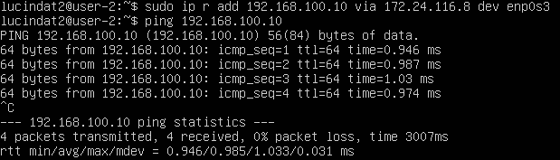
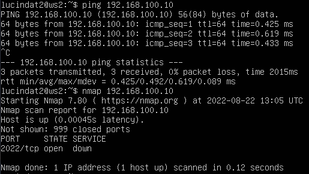
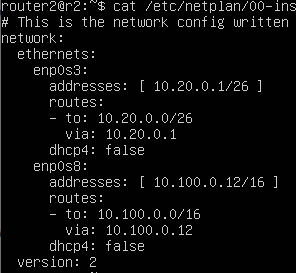
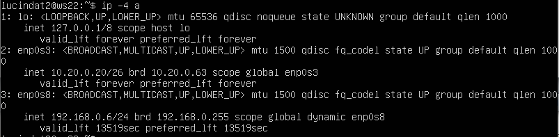
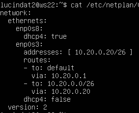
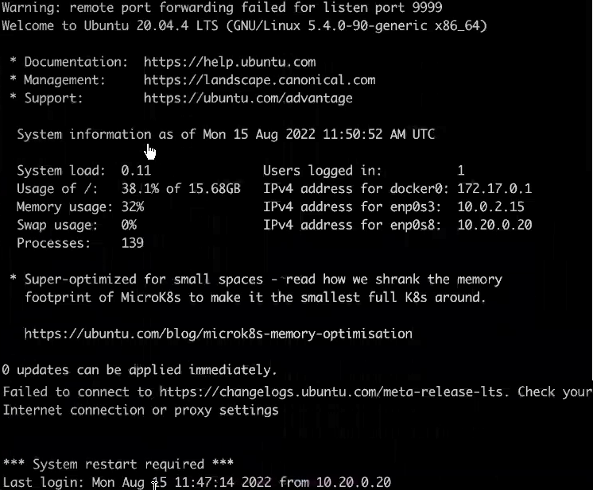

# Сети в Linux

Настройка сетей в Linux на виртуальных машинах.

## Содержание

1. [Часть 1. Инструмент ipcalc.](#part-1-инструмент-ipcalc)
2. [Часть 2. Статическая маршрутизация между двумя машинами.](#part-2-статическая-маршрутизация-между-двумя-машинами)
3. [Часть 3. Утилита iperf3.](#part-3-утилита-iperf3)
4. [Часть 4. Сетевой экран.](#part-4-сетевой-экран)
5. [Часть 5. Статическая маршрутизация сети.](#part-5-статическая-маршрутизация-сети)
6. [Часть 6. Динамическая настройка IP с помощью DHCP.](#part-6-динамическая-настройка-ip-с-помощью-dhcp)
7. [Часть 7. NAT.](#part-7-nat)
8. [Часть 8. Знакомство с SSH Tunnels.](#part-8-дополнительно-знакомство-с-ssh-tunnels)

## Part 1. Инструмент **ipcalc** 

##### Поднять виртуальную машину (далее -- ws1)

Для запуска виртуальной машины можно использовать Docker/VirtualBox/VSCode с wsl. В моей работе будет использован VirtualBox.

#### 1.1 Сети и маски

##### Определить и записать в отчёт:
##### 1) Адрес сети *192.167.38.54/13*

Адрес и полная информация о сети `192.167.38.54/13` представлена на скриншоте ниже:  

##### 2) Перевод маски *255.255.255.0* в префиксную и двоичную запись, */15* в обычную и двоичную, *11111111.11111111.11111111.11110000* в обычную и префиксную

  
  

##### 3) Минимальный и максимальный хост в сети *12.167.38.4* при масках; */8*, *11111111.11111111.00000000.00000000*, *255.255.254.0* и */4*

  

#### 1.2. localhost

##### Определить и записать в отчёт, можно ли обратиться к приложению, работающему на localhost, со следующими IP: *194.34.23.100/16*, *127.0.0.2/24*, *127.1.0.1/8*, *128.0.0.1/8*

> Для того, что бы понять, можно ли обратится к приложению localhost, нужно прописать команду `ping "ip address"`, мы увидим следующую картину:
Адреса, которые доступны, будут постоянно показывать какой-либо ответ, не доступные же адреса не будут отправлять никакого ответа и при отмене действия с помощью `^c` будет видна ошибка , с содержанием `100% packet loss`:

- Вне диапазона 127.0.0.1 — 127.255.255.254 и не пингуются: 128.0.0.1/8, 194.34.23.100/16

#### 1.3. Диапазоны и сегменты сетей

##### 1) какие из перечисленных IP можно использовать в качестве публичного, а какие только в качестве частных: *10.0.0.45/8*, *134.43.0.2/16*, *192.168.4.2/16*, *172.20.250.4/12*, *172.0.2.1/12*, *192.172.0.1/12*, *172.68.0.2/12*, *172.16.255.255/12*, *10.10.10.10/8*, *192.169.168.1/16*

Private: 10.0.0.45/8, 172.20.250.4/12, 172.68.0.2/12, 172.16.255.255/12, 10.10.10.10/8
Public: 134.43.0.2/16, 192.168.4.2/16, 172.0.2.1/12, 192.172.0.1/12, 192.169.168.1/16

##### 2) какие из перечисленных IP адресов шлюза возможны у сети *10.10.0.0/18*: *10.0.0.1*, *10.10.0.2*, *10.10.10.10*, *10.10.100.1*, *10.10.1.255*

Диапазон IP , которые могут быть у сети прописан в `host min` и `host max`

  
Можем сделать вывод, что доступны следующие IP: *10.10.0.2*, *10.10.10.10*.

## Part 2. Статическая маршрутизация между двумя машинами

С помощью команды ip a посмотреть существующие сетевые интерфейсы

Описать сетевой интерфейс, соответствующий внутренней сети, на обеих машинах и задать следующие адреса и маски: ws1 - 192.168.100.10, маска /16, ws2 - 172.24.116.8, маска /12

Выполнить команду netplan apply для перезапуска сервиса сети

Добавить статический маршрут от одной машины до другой и обратно при помощи команды вида ip r add
Пропинговать соединение между машинами

#### 2.1. Добавление статического маршрута вручную

Добавить статический маршрут от одной машины до другой с помощью файла etc/netplan/00-installer-config.yaml
Пропинговать соединение между машинами

Статический маршрут в файле прописывается как `route:`, далее мы пишем "куда" `- to:` и откуда `via`:

## Part 3. **Утилита iperf3**

#### 3.1. Скорость соединения

- 8 мегабит/секунда - это 1 (один) мегабайт/секунда.

- 100 мегабит/секунда - это 819200 килобит/секунда.

- 1 гигабит/секунда - это 1024 мегабит/секунда.

#### 3.2. Утилита **iperf3**

Для измерения скорости соединения между ws1 и ws2 нам необходимо сначало установить "iperf3", при помощи команды `sudo apt install iperf3` для двух виртуальных машин. Далее, на одной из них запустить сервер iperf3 при помощи `iperf3 -s` а со второй запустить тестирование скорости соединения при помощи команды `iperf3 -c "ip address"`:
## Part 3. **Утилита iperf3**

#### 3.1. Скорость соединения

- 8 мегабит/секунда - это 1 (один) мегабайт/секунда.

- 100 мегабит/секунда - это 819200 килобит/секунда.

- 1 гигабит/секунда - это 1024 мегабит/секунда.

#### 3.2. Утилита **iperf3**

Для измерения скорости соединения между ws1 и ws2 нам необходимо сначало установить "iperf3", при помощи команды `sudo apt install iperf3` для двух виртуальных машин. Далее, на одной из них запустить сервер iperf3 при помощи `iperf3 -s` а со второй запустить тестирование скорости соединения при помощи команды `iperf3 -c "ip address"`:

## Part 4. Сетевой экран

#### 4.1. Утилита **iptables**

- Нужно добавить в файл подряд следующие правила:
   - на ws1 применить стратегию когда в начале пишется запрещающее правило, а в конце пишется разрешающее правило (это касается пунктов 4 и 5)
   - на ws2 применить стратегию когда в начале пишется разрешающее правило, а в конце пишется запрещающее правило (это касается пунктов 4 и 5)
   - открыть на машинах доступ для порта 22 (ssh) и порта 80 (http)
   - запретить *echo reply* (машина не должна "пинговаться”, т.е. должна быть блокировка на OUTPUT)
   - разрешить *echo reply* (машина должна "пинговаться")

##### Создать файл */etc/firewall.sh*, имитирующий фаерволл, на ws1 и ws2:

##### Запустить файлы на обеих машинах командами `chmod +x /etc/firewall.sh` и `/etc/firewall.sh`

  
Запускаем скрипт для ws1 и ws2.

> В двух скриптах мы открываем 22 и 80 порты, но в одном из них следом запрещаем echo-request, в другом разрешаем. Т.е в первом случае виртуальная машина не будет видна (не будет пинговаться), вторая соответственно, наоборот.

#### 4.2. Утилита **nmap**.

##### Командой **ping** найти машину, которая не "пингуется", после чего утилитой **nmap** показать, что хост машины запущен.

Устанавливаем "nmap", при помощи команды `sudo apt install nmap` для двух виртуальных машин.
После команды `ping` выясняем, что не пингуется первая машина (ws1), но при проверке утилитой nmap мы убеждаемся, что машина все таки доступна (надпись host is up).

  
Пингуем 172.24.116.8. Проверяем утилитой nmap, что хост машины запущен.

  
Пингуем 192.168.100.10. Проверяем утилитой nmap, что хост машины запущен.

## Part 5. Статическая маршртизация сети

##### Поднять пять виртуальных машин (3 рабочие станции (ws11, ws21, ws22) и 2 роутера (r1, r2)).

Создаем пять виртуальных машин в "VirtualBox", для рабочих станций включаем в разделе "Сеть" два адаптера, для роутеров три адаптера. В "Тип подключения" выбираем "Внутренняя сеть".

#### 5.1. Настройка адресов машин

##### Настроить конфигурации машин в *etc/netplan/00-installer-config.yaml* согласно сети на рисунке.

  
Настройка для рабочей станции ws11.

  
Настройка для рабочей станции ws22.

  
Настройка для рабочей станции ws21.

  
Настройка для роутера r1.

  
Настройка для роутера r2.

##### Перезапустить сервис сети. Если ошибок нет, то командой `ip -4 a` проверить, что адрес машины задан верно. Также пропинговать ws22 с ws21. Аналогично пропинговать r1 с ws11.

Для перезапуска сервиса сети была использована команда `sudo reboot` для полного рестарта виртуальной машины.

Результаты команды `ip -4 a` и пинг с одной машины другой и с роутера машины представлены на следующих скриншотах:

  
Результаты команды `ip -4 a` для рабочей станции ws11. Результаты пинга r1 с ws11.

  
Результаты команды `ip -4 a` для рабочей станции ws22.

  
Результаты команды `ip -4 a` для рабочей станции ws21. Результаты пинга ws22 с ws21.

  
Результаты команды `ip -4 a` для роутера r1.

  
Результаты команды `ip -4 a` для роутера r2.

#### 5.2. Включение переадресации IP-адресов.
##### Для включения переадресации IP, выполните команду на роутерах:
`sysctl -w net.ipv4.ip_forward=1`

  
Включаем переадресцию IP для r1.

  
Включаем переадресцию IP для r2.

##### Откройте файл */etc/sysctl.conf* и добавьте в него следующую строку:
`net.ipv4.ip_forward = 1`

Добавляем изменения (убираем комментарий к уже сформированной строке):

  
Включаем переадресцию IP для r1.

  
Включаем переадресцию IP для r2.

#### 5.3. Установка маршрута по-умолчанию

##### Настроить маршрут по-умолчанию (шлюз) для рабочих станций. Для этого добавить gateway4 \[ip роутера\] в файле конфигураций.

Добавляем в качестве шлюза IP связующих роутеров:

  
Настраиваем маршрут для ws11.

  
Настраиваем маршрут для ws22.

  
Настраиваем маршрут для ws21.

##### Вызвать `ip r` и показать, что добавился маршрут в таблицу маршрутизации

  
  
  
Скрин вызова `ip r` для ws11, ws21, ws22.

##### Пропинговать с ws11 роутер r2 и показать на r2, что пинг доходит. Для этого использовать команду: `tcpdump -tn -i eth1`

Для пинга воспользуемся командой `ping "router ip"`:  
  
Пингуем r2.

  
Проверяем пинг командой `tcpdump -tn -i enp0s9`.

#### 5.4. Добавление статических маршрутов

##### Добавить в роутеры r1 и r2 статические маршруты в файле конфигураций. Пример для r1 маршрута в сетку 10.20.0.0/26:
##### Вызвать `ip r` и показать таблицы с маршрутами на обоих роутерах. Пример таблицы на r1:

  
Результат применения команды изображен для r1 и r2.

##### Запустить команды на ws11: `ip r list 10.10.0.0/[маска сети]` и `ip r list 0.0.0.0/0`

  
Результат выполнения команд `ip r list 10.10.0.0/18` и `ip r list 0.0.0.0/0`.

> Маршруту с подсетью 0.0.0.0/0 иногда придают особое значение и называют "Default Route" или "gateway of last resort". На самом деле в нем нет ничего магического и он просто включает все возможные адреса IPv4, но данные названия хорошо описывают его задачу — он указывает на шлюз, куда пересылать пакеты для которых нет других, более точных, маршрутов.

> Для адреса 10.10.0.0/[порт сети] был выбран маршрут, отличный от 0.0.0.0/0, хотя он попадает под маршрут по-умолчанию, потому что маршрутизатор выбирает маршрут с самой длинной маской, для более точного решения. Следовательно маршрут по умолчанию не будет выбран пока существуют другие маршруты.

#### 5.5. Построение списка маршрутизаторов

##### Запустить на r1 команду дампа:
`tcpdump -tnv -i enp0s8`

  
Скрин команды `tcpdump -tnv -i enp0s8`.

Tcpdump - это утилита командной строки, которая позволяет вам захватывать и анализировать сетевой трафик, проходящий через вашу систему. Он часто используется для устранения неполадок в сети, а также для обеспечения безопасности.

##### При помощи утилиты **traceroute** построить список маршрутизаторов на пути от ws11 до ws21

Для построения маршрутизации с помощью *traceroute* достаточно просто ввести команду `traceroute "ip address"`:
Для установки утилиты **traceroute** испрльзуем команду `sudo apt install traceroute` 

> Traceroute основана на протоколе ICMP. Программа traceroute выполняет отправку данных указанному узлу сети, при этом отображая сведения о всех промежуточных маршрутизаторах, через которые прошли данные на пути к целевому узлу.

#### 5.6. Использование протокола **ICMP** при маршрутизации

##### Запустить на r1 перехват сетевого трафика, проходящего через eth0 с помощью команды: `tcpdump -n -i eth0 icmp`

Дамп и пинг на несуществующий адрес представлены на скриншоте ниже:

  
Скрин команды `tcpdump -n -i enp0s8 icmp`.

## Part 6. Динамическая настройка IP с помощью **DHCP**

##### Для r2 настроить в файле */etc/dhcp/dhcpd.conf* конфигурацию службы **DHCP**:
Для установки **isc-dhcp-server** используем команду `sudo apt install isc-dhcp-server` 

##### 1) указать адрес маршрутизатора по-умолчанию, DNS-сервер и адрес внутренней сети. Пример файла для r2:

  
Настраиваем конфигурацию службы DHCP для r2.

##### 2) в файле *resolv.conf* прописать `nameserver 8.8.8.8.`

##### Перезагрузить службу **DHCP** командой `systemctl restart isc-dhcp-server`. Машину ws21 перезагрузить при помощи `reboot` и через `ip a` показать, что она получила адрес. Также пропинговать ws22 с ws21.

  
Скрин результата команды `systemctl restart isc-dhcp-server` и `systemctl status isc-dhcp-server` для r2.

  
Скрин команд `reboot`, `ip a` для ws21. Пингуем ws22 с ws21.

##### Указать MAC адрес у ws11, для этого в *etc/netplan/00-installer-config.yaml* надо добавить строки: `macaddress: 10:10:10:10:10:BA`, `dhcp4: true`

##### Для r1 настроить аналогично r2, но сделать выдачу адресов с жесткой привязкой к MAC-адресу (ws11). Провести аналогичные тесты

##### Запросить с ws21 обновление ip адреса

Для освобождения ip адресса на `enp0s8(eth0)`  воспользуемся командой `sudo dhclient -r enp0s8`
Для выделения адреса на `epn0s8(eth0)` воспользуемся командой `sudo dhclient -v enp0s8`

Когда вы запускаете команду dhclient или когда загружаете компьютер, dhclient отправляет широковещательные сообщения (DHCP Discover) в подсети для обнаружения доступных DHCP-серверов. Пакет DHCP Discover включает в себя MAC-адрес физического компьютера для клиента, который будет идентифицирован сервером. Затем сервер DHCP отправляет ответ (ПРЕДЛОЖЕНИЕ DHCP) с предложением отправить IP-адрес. Клиент отвечает пакетом запроса или запросом DHCP, принимая предложение. Затем DHCP-сервер назначает клиенту IP-адрес, интегрируя его в сеть. Этот процесс известен как согласование DHCP.

Что касается пакетов, мы можем резюмировать этот процесс как DHCPDISCOVER> DHCPOFFER> DHCPREQUEST> DHCPACK, где:
 
DHCPDISCOVER: клиент отправляет пакет в подсети в поисках доступных DHCP-серверов для получения IP-адреса.

DHCPOFFER: когда пакет получен DHCP-сервером, сервер отправляет сообщение DHCPOFFER обратно клиенту, идентифицированному его MAC-адресом, а затем предлагает назначить ему свободный или неиспользуемый IP-адрес.

DHCPREQUEST: клиент отправляет пакет DHCP-серверу, принимая предложение. Если более одного DHCP-сервера предлагали IP-адрес, клиент примет первый полученный, а другие DHCP-серверы будут уведомлены о том, что первоначальный запрос уже был удовлетворен.

DHCPACK: Наконец, после того, как DHCP-сервер получил последний пакет запроса от клиента. Он ответит пакетом DHCPACK, завершающим назначение IP.

## Part 7. **NAT**

##### В файле */etc/apache2/ports.conf* на ws22 и r1 изменить строку `Listen 80` на `Listen 0.0.0.0:80`, то есть сделать сервер Apache2 общедоступным

Для установки **apache2** используем команду `sudo apt install apache2` 
Для изменения строки `Listen 80` откроем при помощи текстового редактора "vim" указанный выше файл и отредактируем в соответствии с заданием:

  
Делаем сервер Apache2 общедоступным для ws22 и r1.

##### Запустить веб-сервер Apache командой `service apache2 start` на ws22 и r1

  
Запускаем веб-сервер Apache командой `service apache2 start` на r1.

  
Запускаем веб-сервер Apache командой `service apache2 start` на ws22.

##### Добавить в фаервол, созданный по аналогии с фаерволом из Части 4, на r2 следующие правила:
##### 1) Удаление правил в таблице filter - `iptables -F`
##### 2) Удаление правил в таблице "NAT" - `iptables -F -t nat`
##### 3) Отбрасывать все маршрутизируемые пакеты - `iptables --policy FORWARD DROP`
##### Запускать файл также, как в Части 4
##### Проверить соединение между ws22 и r1 командой `ping`

После добавления новых правил в фаерволл пробуем проверить соединение, как и должно, с роутера не "пингуется" ws22:

  
Добавляем правила в фаерволл.

  
Проверяем, что с роутера не "пингуется" ws22.

##### Добавить в файл ещё одно правило:
##### 4) Разрешить маршрутизацию всех пакетов протокола **ICMP**

##### 5) Включить **SNAT**, а именно маскирование всех локальных ip из локальной сети, находящейся за r2 (по обозначениям из Части 5 - сеть 10.20.0.0)

##### 6) Включить **DNAT** на 8080 порт машины r2 и добавить к веб-серверу Apache, запущенному на ws22, доступ извне сети

  
Добавляем правила для **SNAT** и **DNAT** в фаерволл.

##### Проверить соединение по TCP для **SNAT**, для этого с ws22 подключиться к серверу Apache на r1 командой: `telnet [адрес] [порт]`

  
Проверяем соединение по TCP для **SNAT**.

##### Проверить соединение по TCP для **DNAT**, для этого с r1 подключиться к серверу Apache на ws22 командой `telnet` (обращаться по адресу r2 и порту 8080):

  
Проверяем соединение по TCP для **DNAT**.

## Part 8. Дополнительно. Знакомство с **SSH Tunnels**

##### Запустить веб-сервер **Apache** на ws22 только на localhost (то есть не изменять файл */etc/apache2/ports.conf* или, если был изменен ранее, вернуть строку `Listen 80`)
  
Запускаем веб-сервер Apache командой `service apache2 start` на ws22.

##### Воспользоваться *Local TCP forwarding* с ws21 до ws22, чтобы получить доступ к веб-серверу на ws22 с ws21

  
Подключаемся к к веб-серверу на ws22 с ws21 командой `ssh -L 9999:localhost:80 10.20.0.20`.

##### Воспользоваться *Remote TCP forwarding* c ws11 до ws22, чтобы получить доступ к веб-серверу на ws22 с ws11

  
Подключаемся к веб-серверу на ws22 с ws11 командой `ssh -R 9999:localhost:80 10.20.0.20`.

##### Для проверки, сработало ли подключение в обоих предыдущих пунктах, перейдите во второй терминал (например, клавишами Alt + F2) и выполните команду: `telnet 127.0.0.1 [локальный порт]`

  
Проверяем подключение командой `telnet 127.0.0.1 80`.

