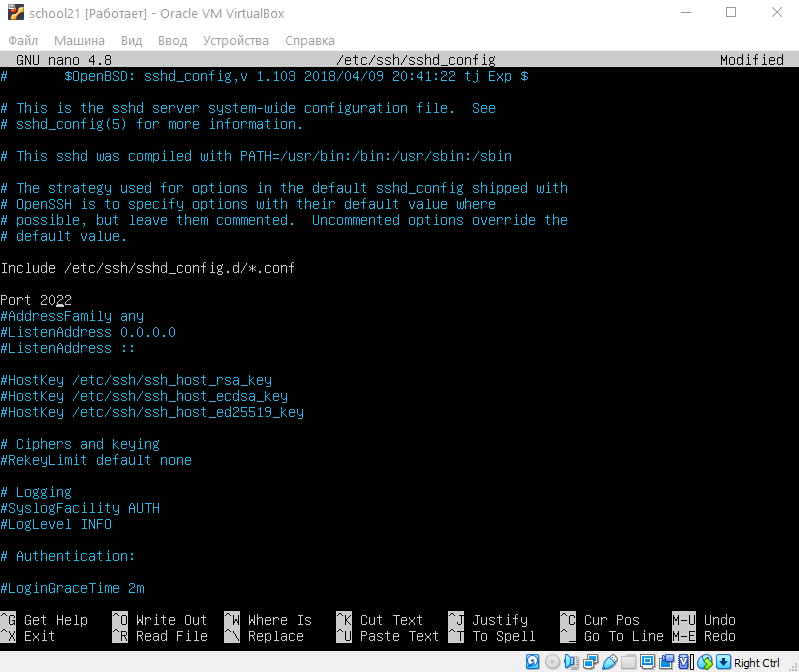

## Part 1. Установка ОС

+ Версия Ubuntu: 20.04 LTS получена после выполнения команды: `cat /etc/issue` 

## Part 2. Создание пользователя

+ `sudo useradd -G adm test_user` - создание нового пользователя и добавление в группу adm 
+ `cat /etc/passwd` - видим нового пользователя после вывода данной команды  

## Part 3. Настройка сети ОС

+ Старое имя машины  

+ После reboot убедились что изменения сохранились  

+ Установили временную зону, соответствующую моему текущему местоположению.  

+ Вывести названия сетевых интерфейсов с помощью консольной команды `ls /sys/class/net/`  
  
>lo (loopback device) – виртуальный интерфейс, присутствующий по умолчанию в любом Linux. Он используется для отладки сетевых программ и запуска серверных приложений на локальной машине. С этим интерфейсом всегда связан адрес 127.0.0.1. У него есть dns-имя – localhost.

+ Используя команду `hostname -I` получили ip адрес устройства, на котором мы работаем, от DHCP сервера.  

>DHCP (англ. Dynamic Host Configuration Protocol — протокол динамической настройки узла) — прикладной протокол, позволяющий сетевым устройствам автоматически получать IP-адрес и другие параметры, необходимые для работы в сети TCP/IP. 

+ Внешний ip-адрес шлюза (ip) и внутренний IP-адрес шлюза, он же ip-адрес по умолчанию (gw).  

  * 10.0.2.15 - внешний ip-адрес шлюза (ip)  
  * 10.0.2.2 - внутренний IP-адрес шлюза, он же ip-адрес по умолчанию (gw).  
+ Для настройки динамического IP- адреса для интерфейса enp0s3 создадим новый конфигурационный файл 00-installer-config.yaml. 
  `sudo nano /etc/netplan/00-installer-config.yaml`  
  
  * `sudo netplan generate`  
  * `sudo netplan apply`  
  * `reboot`    
+ Убедились, что статичные сетевые настройки (ip, gw, dns) соответствуют заданным после reboot.  

+ Успешно пропинговали удаленные хосты 1.1.1.1 и ya.ru  

## Part 4. Обновление ОС

+ Обновили системные пакеты до последней на момент выполнения задания версии. 
`sudo apt full-upgrade` 

## Part 5. Использование команды sudo
 
>sudo (англ. Substitute User and do, дословно «подменить пользователя и выполнить») — программа для системного администрирования UNIX-систем, позволяющая делегировать те или иные привилегированные ресурсы пользователям с ведением протокола работы. Основная идея — дать пользователям как можно меньше прав, при этом достаточных для решения поставленных задач.

+ `sudo visudo` – добавляем права sudo пользователю test\_user 

+ меняем пользователя 

+ от имени пользователя меняем hostname 

## Part 6. Установка и настройка службы времени

+ Настройка службы автоматической синхронизации времени.
+ Вывод команды `timedatectl show` содержит `NTPSynchronized=yes`  

## Part 7. Установка и использование текстовых редакторов

+ Редактор **VIM**. Создала файл test_vim.txt. Написала в нём свой никнейм, закрыла файл с сохранением изменений. 
`Esc, shift+ZZ` 

+ Редактор **NANO**. Создала файл test_nano.txt. Написала в нём свой никнейм, закрыла файл с сохранением изменений. 
`Ctrl+S, Ctrl+X` 

+ Редактор **MCEDIT**. Создала файл test_mcedit.txt. Написала в нём свой никнейм, закрыла файл с сохранением изменений. 
`F2 – сохранить, f10 – выйти` 

+ Открыла файл test_vim.txt на редактирование, отредактировала, заменив никнейм на строку "21 School 21", закрыла файл без сохранения изменений. 
`Esc, :q!` 

+ Открыла файл test_nano.txt на редактирование, отредактировала, заменив никнейм на строку "21 School 21", закрыла файл без сохранения изменений. 
`Ctrl+X, n` 

+ Открыла файл test_mcedit.txt на редактирование, отредактировала, заменив никнейм на строку "21 School 21", закрыла файл без сохранения изменений. 
`F10, нет` 

+ Отредактировала файл test_vim.txt ещё раз, а затем произвела поиск слова по файлу  
`/`  

+ Отредактировала файл test_nano.txt ещё раз, а затем произвела поиск слова по файлу  
`:s/lu/s21`  

+ Отредактировала файл test_mcedit.txt ещё раз, а затем произвела поиск слова по файлу  
`Ctrl+W`  

+ Произвела замену с помощью редактора VIM  
`Ctrl+\, lu, enter, s21, enter`  

+ Произвела замену с помощью редактора NANO  
`f7`  

+ Произвела замену с помощью редактора MCEDIT  
`f4`  

## Part 8. Установка и базовая настройка сервиса SSHD

`sudo apt-get install ssh` – установка ssh  
`sudo apt install openssh-server` – установка OpenSSH  
`sudo systemctl enable sshd` – добавление пакета в автозагрузку  
`systemctl status sshd` – проверка работы ssh  

+ Проверяем состояние демона sshd  

+ Перенастроили службу SSHd на порт 2022  
`sudo nano /etc/ssh/sshd_config`  

+ Используя команду ps, увидили наличие процесса sshd  

+ Вывод команды `netstat -tan`:  

>Первый столбец указывает тип соединения. Recv-Q указывает количество байтов, не скопированных пользовательской программой, подключенной к этому сокету. (Если все работает хорошо. то его значение 0) Send-Q количество байтов, не подтвержденных удаленным хостом. (Если все работает хорошо. то его значение 0) Local adress Foreign Addres показывают локальный и внешний адрес соответственно
>Значение 0.0.0.0 является значением по умолчанию. В контексте серверов 0.0.0.0 может означать «все адреса IPv4 на локальном компьютере». Если хост имеет два IP-адреса и сервер, работающий на хосте, настроен на прослушивание 0.0.0.0 , он будет доступен по обоим этим IP-адресам. 
## Part 9. Установка и использование утилит top, htop

+ Запуск утилиты top  

  + uptime – **1 мин**
  + количество авторизованных пользователей - **1**
  + общая загрузка системы – **0,43**
  + общее количество процессов - **100**
  + загрузка cpu:

    - us -(%) действия в пользовательском пространстве;
    - sy - (%)затраченного на действия в пространстве ядра;
    - ni - (%) затраченного на процессы с низким приоритетом
    - id - процент (%) затраченного на простаивание - какое количество времени процессор делает ничего – **100%**
    - wa - процент (%) затраченного на ожидание дисковых операций.
    - hi - процент (%) процессорного времени, затраченного на обработку аппаратных прерываний;
    - si - процент (%) процессорного времени, затраченного на обработку прерываний ПО;
    - st - время в вынужденном ожидании виртуального CPU, пока гипервизор обслуживает другой процессор.

  + загрузка памяти – **145,0**
  + pid процесса занимающего больше всего памяти - **1**
  + pid процесса, занимающего больше всего процессорного времени – **1**

+ Запуск утилиты htop, отсортированному по PID  

+ Запуск утилиты htop, отсортированному по PERCENT_CPU  

+ Запуск утилиты htop, отсортированному по PERCENT_MEM  

+ Запуск утилиты htop, отсортированному по TIME  

+ Запуск утилиты htop, отфильтрованному для процесса sshd  

+ Запуск утилиты htop, с процессом syslog, найденным, используя поиск  

+ Запуск утилиты htop, с добавленным выводом hostname, clock и uptime  

## Part 10. Использование утилиты fdisk

+ Запуск команды **fdisk -l**  

  - название жесткого диска - **sda**
  - размер – **10 GiB**
  - количество секторов - **20971520**
  - размер swap - **1,7 GiB**

## Part 11. Использование утилиты df

+ Запуск команды `df`  

  - размер раздела – **9299276**
  - размер занятого пространства  - **4896136**
  - размер свободного пространства – **3909164**
  - процент использования – **56%**
  - единица измерения – **килобайт**

+ Запуск команды `df -Th`  

  - размер раздела - **8,9G**
  - размер занятого пространства – **4,7G**
  - размер свободного пространства  - **3,8G**
  - процент использования – **56%**
  - тип файловой системы для раздела – **ext4**

## Part 12. Использование утилиты du

+ Запуск команды `du`. Вывод размера папок /home, /var, /var/log (в байтах)  
  

+ Вывод размера всего содержимого в /var/log  

## Part 13. Установка и использование утилиты ncdu

+ Вывод размера папки /home  

+ Вывод размера папки /var  

+ Вывод размера папки /var/log  

## Part 14. Работа с системными журналами

+ Открыла для просмотра `/var/log/dmesg`  

+ Открыла для просмотра `/var/log/syslog`  

+ Открыла для просмотра `/var/log/auth.log`  

+ Найти время входа в систему можно в /var/log/wtmp или при помощи команды last, которая берет данные оттуда. Данные последнего входа в систему.  

+ Как видим, последним входил пользователь lucindat, по ssh соединению, в 17:55 по местному времени.  

## Part 15. Использование планировщика заданий CRON

+ Используя планировщик заданий, запустила команду `uptime` через каждые 2 минуты  
+ Через несколько минут проверим syslog командой `cat /var/log/syslog | grep CRON`  

+ Удалила все задания из планировщика заданий  

